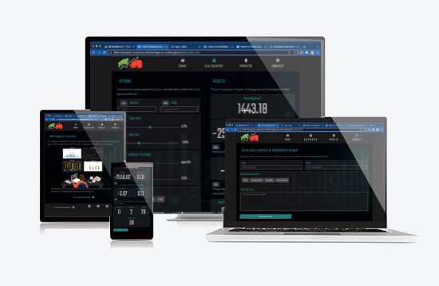

# Trade Probability Calculator Website
 

 
 
This site.
 
You can visit the deployed website [here](https://barrybeics.github.io/Project-Two/).
 
  
 
## 1. UX
---
 
### 1.1. Project Goals ###
 
Picking a trading strategy can be complex. This site will help users gain a better understanding of what impact changing parameters can have on the effectiveness of a given trading strategy.
Users are also be able to contact the developer using the contact form to make suggestions for improvments to the site.
 
### 1.2. User Stories ###
 
- As a USER I want to be able to add the amount I would steak in a trading strategy
- As a USER I want to be able to factor in by broker fees so that I see the cost of a trading strategy
- As a USER I want to be able to vary the point I would take profit from a trade so that I can see the effect this would have on the overall strategy 
- As a USER I want to be able to vary the point I would exit from a trade so that I can see the effect this would have on the overall strategy 
- As a USER I want to be able to vary the volatility in the simulation so that I can see the effect this would have on the overall strategy 
- As a USER I want to be able to vary the percentage of gain the simulation is working on so that I can see the effect this would have on the overall strategy 
- As a USER I want to be able to change the time spent in a trade so that I can see the effect this would have on the overall strategy 
- As a USER I want to be able to change the duration the simulation will run for so that I can see the effect this would have on the overall strategy 
- As a USER I want simple explanations of any complex terminology so that I can understand what it is I’m making changes to
- As a USER I want a simple interface so that I can cycle between strategies quickly and easily
- As a USER I want a simple summary of the results so that I can quickly understand if change I have made have improved my strategy or not
- As a USER I want a to be able to save results for later comparison
- As a USER I want to be able to contact the developer to suggest future developments to the site

 
 
### 1.3. Design ###
 
- **Colour Scheme**: The colours have been selected to 
 
- **Typography**: The site uses 2 fonts, Firstly for the body text and buttons Montserrat font was the choice, Montserrat is a clean font used frequently in programming, so it is both attractive and appropriate. Secondly for the headings, navigation text and to display the results Teko is the choice, this is a slim font allowing for more content to be displayed in a small area. Both fonts have Sans Serif as the fallback font in case for any reason the font isn't being imported into the site correctly.
 
- **Imagery**: T
 
### 1.4. Wireframes ###
 
The wireframes for this site were produced in Balsamiq (https://balsamiq.com/). Wire frames were created for Desktop, Tablet & mobile respectively.

  
Wireframe - [View](WIREFRAMES.md)
 
  
 
## 2. Features
---
 
### 2.1. Existing features ###
 
**The Header** includes:
 
- **Navigation Bar**: allows users to navigate the site in an easy and intuitive way.
 
**The Footer** includes:
 
- **Social**: allows users to know more about the developer. These are all links to real accounts as I intend develop this project futher over time.
 
Both the Header and the Footer are consistent throughout the website.
 
**Home Page** includes:
 
- **overview**: A couple of sentances to give a brief explanation of the the site does.
Graphic showing a person work hard to understand trading strategy, this displays a smaller image on mobile screens.
 
 
**Calculator Page** includes:
 
- **Options Panel**: Allows for input of various parameters but the user.
- **Results Panel**: Show the results of the current trading strategy.

 
**Results Page** includes:
 
- **Description of each project**: allows the users to quickly understand the scope of the project.

 
**Contact Page** includes:
 
- **Personal info**: allows users to post documents, phone and email files to the developer if necessary.
- **Contact form**: allows users to make initial contact in a structured format so that the developer can respond with an answer and not need to ask for more details.
 

 
### 2.2. Features left to implement in the future ###
 

- Offer other volatility indicators
- API to get live currency prices
- Ability to sort results by success rate, percentage profit
- Setting page to allow further customization

 
  
 
## 3. Technologies used
---
 
### 3.1. Languages Used ###
 
-   [HTML5](https://en.wikipedia.org/wiki/HTML5)
-   [CSS3](https://en.wikipedia.org/wiki/Cascading_Style_Sheets)
-   [Javascript](https://en.wikipedia.org/wiki/JavaScript)

### 3.2. Frameworks, Libraries & Programs Used ###
 
- [Bootstrap 4.4.1:](https://getbootstrap.com/docs/4.4/getting-started/introduction/) - Bootstrap was used to handle the responsive layout of the website.
- [Hover.css:](https://ianlunn.github.io/Hover/) - Hover.css was used on the navigation buttons with the underline-from-center effect and the Social Media icons in the footer pop was used for a response while being hovered over.
- [Google Fonts:](https://fonts.google.com/) - Google fonts were used to import the 'Montserrat' & 'Teko' fonts into the style.css file which is used on all pages throughout the project.
- [Font Awesome:](https://fontawesome.com/) - Font Awesome was used on the navigation buttons and in the footer which are present on all pages throughout the website to add icons for aesthetic and UX purposes.
- [Gitpod](https://gitpod.io/) - Git was used for version control by utilizing the Gitpod terminal to commit to Git and Push to GitHub.
- [GitHub:](https://github.com/) - GitHub is used to store the project's code after being pushed from Git.
- [Photoshop:](https://www.adobe.com/ie/products/photoshop.html) - Photoshop was used to resize graphics and customise the bulls n bears logo.
- [Balsamiq:](https://balsamiq.com/) - Balsamiq was used to create the [wireframes](https://github.com/) during the design process.
 
 
  
 
## 4. Testing
---
 
The testing process can be seen [here](TESTING.md).
 
  
 
## 5. Deployment
---
 
**To deploy the project**
 
This project is hosted in GitHub Pages
 
1. Once your viewing the project’s repository on GitHub select **Settings** from just above the green Gitpod button.

2. From the left hand side navigation go down and click on **Pages** link.

3. Inside that section, click on the drop-down menu under **Source** and select **Branch: Main**.
4. Click **Save** and the website is now deployed.

5. The link to the webpage appears in the green box above where you clicked **Save**.
 
Only one branch has been used for this project.

  

**To run the project locally**
 
To clone this project from GitHub:
 
1. Once you navigate the main page of project’s repository on GitHub, above the list of files click **Code**
2. This opens a view showing the url for the project click the copy icon to get the full repository address.

3. Open Terminal and ensure to navigate to the folder where you want to place the cloned project.

4. Type **git clone** and now paste the url you copied earlier.
5. Now press **Enter** to create your local clone of this project
 
 
  
 
## 6. Credits
---
 
### 6.1. Content
All the text on the website has been written by Barry Marples
 
[Bootstrap4](https://getbootstrap.com/docs/4.4/getting-started/introduction/): Bootstrap Library used throughout the project mainly to make the site responsive using the Bootstrap Grid System.
 
[MDN Web Docs](https://developer.mozilla.org/) : For Pattern Validation code. Code was modified to better fit my needs and to match an Irish phone number layout to ensure correct validation. Tutorial Found [Here](https://developer.mozilla.org/en-US/docs/Web/HTML/Element/input/tel#Pattern_validation)
 
### 6.2. Media
 
The graphic on the home page, the logo & the background image are a free downloads from [Vecteezy](https://www.vecteezy.com/vector-art/2214399-stock-trader-exchange):

 
### 6.3. Acknowledgments
 
[Precious Ijege](https://www.linkedin.com/in/precious-ijege-908a00168/?originalSubdomain=ng) for the mentor guidance and support.
 
The [Code Institute](https://codeinstitute.net/) tutor team.
 
 
 
