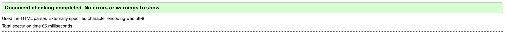
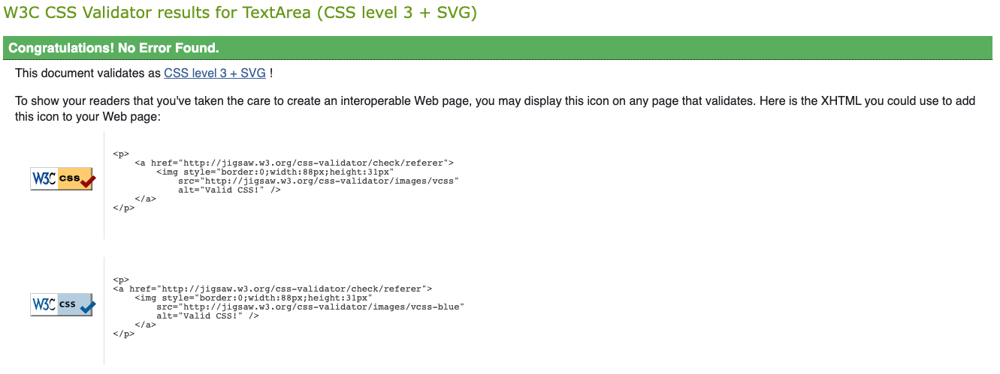
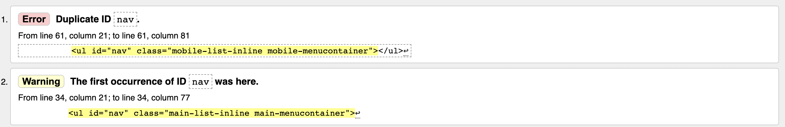

# Testing
 
 
 
## 1. Code Validation
---
The site has been thoroughly tested. All the code has been run through the [W3C html Validator](https://validator.w3.org/) and the [W3C CSS Validator](https://jigsaw.w3.org/css-validator/).
 
### 1.1. HTML ###
 
### - Home page
 

### - Calculator page
 

 
### - Results page
 

 
### - Contact page
 

### - More Info page
 

 
### 1.2. CSS validation ###
 

 
  
 
## 2. Responsiveness Test
---
 
The responsive design tests were carried out manually whilst building the site with [Google Chrome DevTools](https://developer.chrome.com/docs/devtools/) and post build with [Responsive Design Checker](https://www.responsivedesignchecker.com/).
 
### 2.1. Mobiles ###
Notes:
- iPhone5 :   Render fail, Text on form spills of the screen
         Image fail, Portfolio images are too wide for the screen
 
- Galaxy S5/S6/S7 & Xperia Z3/Z3 :   Render fail, Text on form spills of the form box
                                Image fail, Portfolio images are too wide for the screen 
 
- Google Pixel & Nexus 5/6 :   Render fail, Text on one option stacks and doesn't display well 
 
- Nexus 4 :   Render fail, Text on one option stacks and doesn't display well
         Image fail, Portfolio images are too wide for the screen
 
All the errors found have now been fixed as shown below.         
 
|        | iPhone 5 | iPhone 6/7 Plus | Galaxy S5/S6/S7 | Xperia Z3/Z3 | Google Pixel | Nexus 4 | Nexus 5/6 |
|--------|----------|-----------------|-----------------|--------------|--------------|---------|-----------|
| Render |  pass    |  pass           |  pass           |  pass        |  pass        |  pass   |  pass     |
| Images |  pass    |  pass           |  pass           |  pass        |  pass        |  pass   |  pass     |
| Links  |  pass    |  pass           |  pass           |  pass        |  pass        |  pass   |  pass     |
      
### 2.2. Tablets ###
Notes:
- iPad Mini & Kindle Fire :   Render fail, work history text overlaps and displays poorly
                                   
- Nexus 7 & Nexus 9:   Render fail, Link text on portfolio page displays awkwardly
                  Render fail, Tiny gap appears around home nav button
 
All the errors found have now been fixed as shown below.    
 
|        | iPad Mini | iPad Pro | Kindle Fire | Nexus 7 | Nexus 9 | Galaxy Tab 10 |
|--------|-----------|----------|-------------|---------|---------|---------------|
| Render |  pass     |  pass    |  pass       |  pass   |  pass   |  pass         |
| Images |  pass     |  pass    |  pass       |  pass   |  pass   |  pass         |
| Links  |  pass     |  pass    |  pass       |  pass   |  pass   |  pass         |
 
### 2.3. TabletsDesktops ###
Notes:
- 23" Desktop :   Render fail, for this size and above the content begins to loop a bit sparse
 
All the errors found have now been fixed as shown below.
 
|        | 13" Desktop | 15" Desktop | 19" Desktop | 20" Desktop | 22" Desktop | 23" Desktop |
|--------|-------------|-------------|-------------|-------------|-------------|-------------|
| Render |  pass       |  pass       |  pass       |  pass       |  pass       |  pass       |
| Images |  pass       |  pass       |  pass       |  pass       |  pass       |  pass       |
| Links  |  pass       |  pass       |  pass       |  pass       |  pass       |  pass       |
 
 
## Browser Compatibility
This site was tested on the following browsers with no visible issues for the user. Google Chrome, Safari and Mozilla Firefox. Appearance, functionality and responsiveness were consistent throughout for a range of device sizes and browsers.
 
Note: Currently on wide displays the site begins to look sparse, therefore the site should maybe have a max width set in order to hold a neat structure for the site across all devices.
 
  
 
## 3. Testing User Stories
---
 
## Testing User stories

 
- As an owner, I want to showcase skills I have and give examples of previous work to attract more clients.
    - The user can see the skills from the logos displayed on the **Resume page**.
    - The user can view examples of previous work on the **Portfolio page**.
 
- As an owner, I want the possibility for prospective clients and recruiters to contact me easily.
    - The user can find a Contact Form on the **Contact Page** this is always accessable from the top navigation via the Contact tab.
 

- As a user, I want to be able to get in touch with the developer for any reason.
    - The user can access the **Contact Page** any time on the fixed menu on the top of every page, and from there they can complete the contact form.
    - Alternatively the user can find the developer’s Address, Mobile & Email contact details on the **Contact Page** in the Personal Info block.
 
- As a user, I want to be able to view skills and examples of past work.
    - The user can see the skills from the logo's displayed on the **Resume page**.
    - The user can view examples of previous work on the **Portfolio page**.

- As a user, I want to be able to see the developers social media presence.
    - At the footer of every page there a icons linking to the developers social media accounts.
    
- As a recuiter, I want to easily get a copy of the developers CV.
    - At the footer of every page there is a prompt to download the pdf of the developers CV.

- As a curious user, I want to know more about the developer in terms of career history.
    - There is an overview of work history on the **Resume page** to illustrate career history.
    - For futher detail users can easily download a pdf of the developers CV so as to learn more about them.
 
- As a potential client with specific project goals I want to easily communicate my project.
    - The user can complete the contact form on the **Contact Page** which prompts them for all the essential details of their project.
 
 
Back to README - [Back](README.md)
 
 
 
 
  
 
## 4. Bugs
---
 
-   Detailed below are the errors found and actions taken to resolve them.
 
 
- One of the major bugs I found during the development process was the issue of cross device compatibility with the original design as seen in the wireframes..
    - This was solved with some reconfiguration of the layout using the bootstrap elements.
 
- When browsing the site on mobile, there was an unwanted sideways scroll.
    - This was solved by making the images decrease in size based on the width of the screen.
 

    - Fixed: Illegal character in file name of the pdf document
    - Fixed: Correct file path added to footer for pdf file

    - Fixed: Removed stray end tag from line 96 of portfolio.html

    
    - Fixed: Invalid use of a p tag inside a form label removed

    
    - Error, Fixed by changing value to writing-mode: vertical-lr;
 

    
    - Warning, Fixed by applying a slightly darker color to border

[Go back to README.md file](README.md).
 
