# Testing
 
 
 
## 1. Code Validation
---
The site has been thoroughly tested. All the code has been run through the [W3C html Validator](https://validator.w3.org/) and the [W3C CSS Validator](https://jigsaw.w3.org/css-validator/).
 
### 1.1. HTML ###
 
### - Home page
 
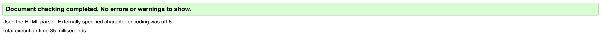

### - Calculator page
 

 
### - Results page
 

 
### - Contact page
 

### - More Info page
 

 
### 1.2. CSS validation ###
 
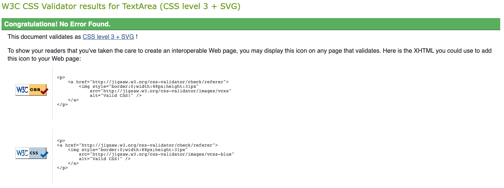
 
  
 
## 2. Responsiveness Test
---
 
The responsive design tests were carried out manually whilst building the site with [Google Chrome DevTools](https://developer.chrome.com/docs/devtools/) and post build with [Responsive Design Checker](https://www.responsivedesignchecker.com/).
 
### 2.1. Mobiles ###

Notes:
- iPhone5, Galaxy S5/S6/S7 & Xperia Z3/Z3 :   Render fail, box breaks onto next line not as intended.

 
All the errors found have now been fixed as shown below.         
 
|        | iPhone 5 | iPhone 6/7 Plus | Galaxy S5/S6/S7 | Xperia Z3/Z3 | Google Pixel | Nexus 4 | Nexus 5/6 |
|--------|----------|-----------------|-----------------|--------------|--------------|---------|-----------|
| Render |  pass    |  pass           |  pass           |  pass        |  pass        |  pass   |  pass     |
| Images |  pass    |  pass           |  pass           |  pass        |  pass        |  pass   |  pass     |
| Links  |  pass    |  pass           |  pass           |  pass        |  pass        |  pass   |  pass     |
      
### 2.2. Tablets ###

Notes:
- iPad Pro :   Padding of half & third boxes needs increasing to display properly.
                                   
- Nexus 7:   Render fail, box breaks onto next line not as intended.
 
All the errors found have now been fixed as shown below.    
 
|        | iPad Mini | iPad Pro | Kindle Fire | Nexus 7 | Nexus 9 | Galaxy Tab 10 |
|--------|-----------|----------|-------------|---------|---------|---------------|
| Render |  pass     |  pass    |  pass       |  pass   |  pass   |  pass         |
| Images |  pass     |  pass    |  pass       |  pass   |  pass   |  pass         |
| Links  |  pass     |  pass    |  pass       |  pass   |  pass   |  pass         |
 
### 2.3. Desktops ###

Notes:
- All Sizes Desktop :   Padding of half & third boxes needs increasing to display properly.
 
All the errors found have now been fixed as shown below.
 
|        | 13" Desktop | 15" Desktop | 19" Desktop | 20" Desktop | 22" Desktop | 23" Desktop |
|--------|-------------|-------------|-------------|-------------|-------------|-------------|
| Render |  pass       |  pass       |  pass       |  pass       |  pass       |  pass       |
| Images |  pass       |  pass       |  pass       |  pass       |  pass       |  pass       |
| Links  |  pass       |  pass       |  pass       |  pass       |  pass       |  pass       |
 
 
## Browser Compatibility

This site was tested on the following browsers with no visible issues for the user. Google Chrome, Safari and Mozilla Firefox. Appearance, functionality and responsiveness were consistent throughout for a range of device sizes and browsers.

 
  
 
## 3. Testing Accessibility
---
 
Lighthouse chrome extension for accessibility was used to check if there was any major issues.

### - Home page
 
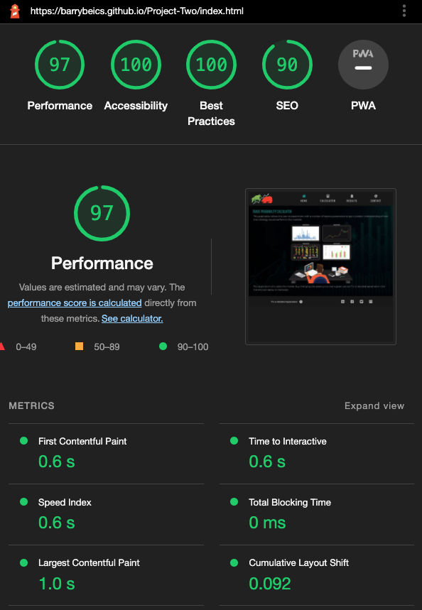

### - Calculator page
 
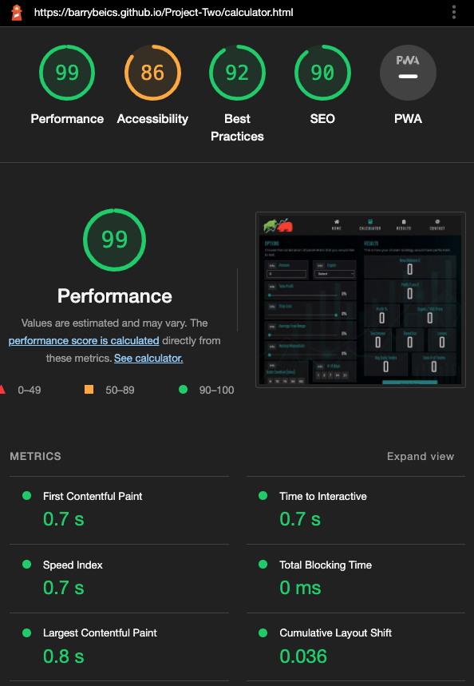
 
### - Results page
 
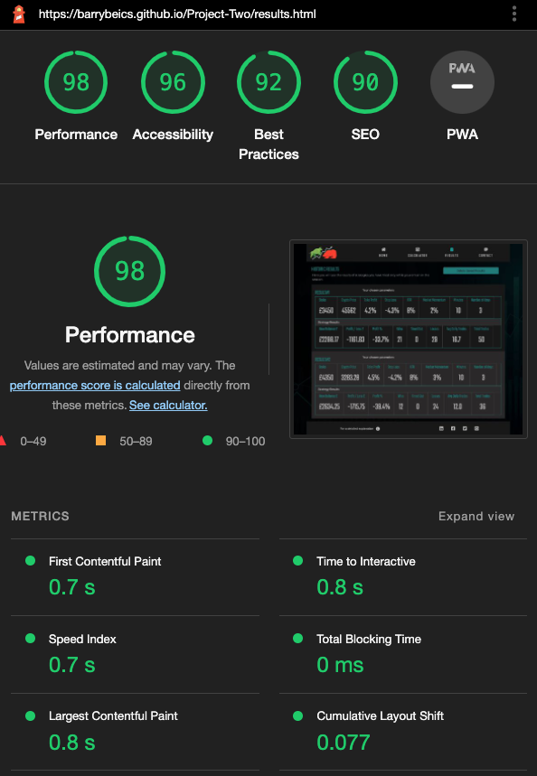
 
### - Contact page
 
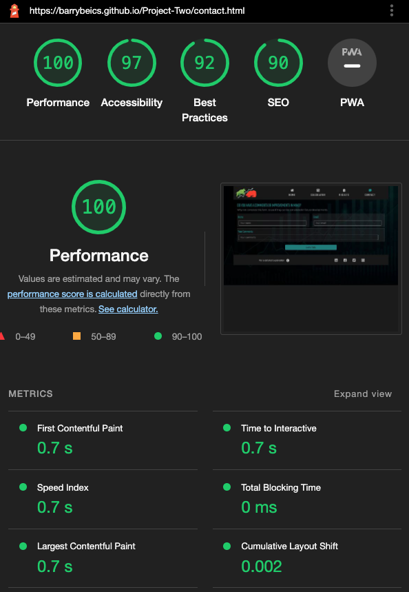

### - More Info page
 
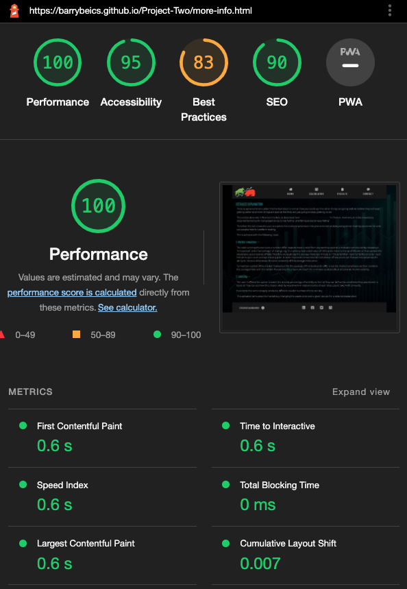

  
 
## 4. Testing User Stories
---
 
## Testing User stories

- As a USER I want to be able to add the amount I would stake in a trading strategy.
- As a USER I want to choose my prefered crypto currency

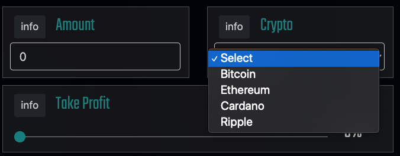

    - The USER can enter any amount they want upto 10,000 into the number input field.
    - The USER can select from the dropdown menu of the four popular crypto currencies.

- As a USER I want to be able to vary the point I would take profit from a trade so that I can see the effect this would have on the overall strategy.

    - The USER can use the slider to adjust the % at which the take profit is executed.

- As a USER I want to be able to vary the point I would exit from a trade so that I can see the effect this would have on the overall strategy.

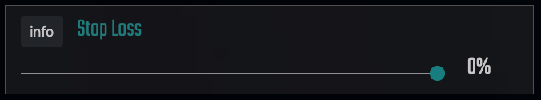

    - The USER can use the slider to adjust the % at which the stop loss is executed.

- As a USER I want to be able to vary the volatility in the simulation so that I can see the effect this would have on the overall strategy.

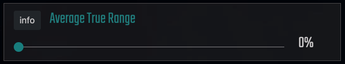

    - The USER can adjust the volatility range in increments of 2% all the way up to 10%, this allows the simulation to whip upto 10% positive and down as far as 10% negative randomly in order to simulate market volatility.

- As a USER I want to be able to vary the percentage of gain the simulation is working on so that I can see the effect this would have on the overall strategy. 

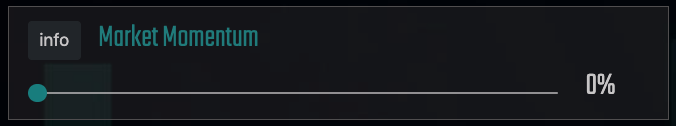

    - The USER can use the slider to choose the market conditions they would set to enter a trade.

- As a USER I want to be able to change the time spent in a trade so that I can see the effect this would have on the overall strategy. 
- As a USER I want to be able to change the duration the simulation will run for so that I can see the effect this would have on the overall strategy. 

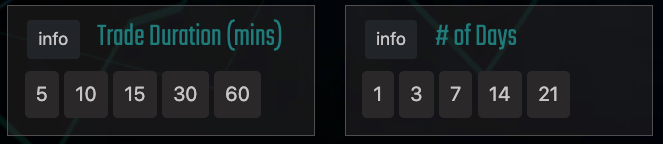

    - The USER can choose from 5, 10, 15, 30 or 60 minutes time frame to stay in any given trade. The shorter the time the more frequently they stategy could trade and the longer the time frame the longer the trade will run until the price either moves up to the set take profit or moves down to the set stop loss figure.
    - The USER can choose from 1, 3, 7, 14 or 21 days. The longer the time period the more realistic the results are likely to be.

- As a USER I want simple explanations of any complex terminology so that I can understand what it is I’m making changes to.

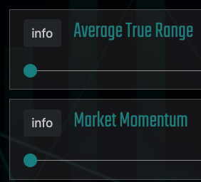
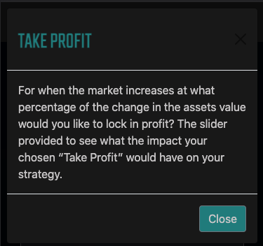

    - The USER is provided with an info button next to each title of a each option and when clicked is provided with a description of said option in a modal.

- As a USER I want a simple interface so that I can cycle between strategies quickly and easily.
- As a USER I want a simple summary of the results so that I can quickly understand if the change I have made has improved my strategy or not.

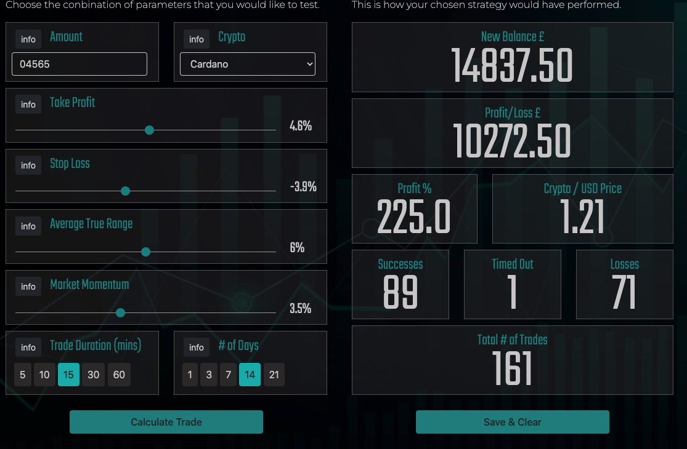

    - The USER is provided with an intuitive selection of sliders, number input, dropdown menu & buttons to make choosing options simple and quick to apply.
    - The USER is provided with a grid of data in a uniform layout with titles and large number displays for ease of comprehension.   

- As a USER I want to be able to save results for later comparison.

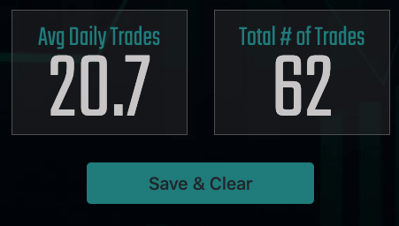

    - The USER is provided with a save button at the foot of the results so as to be able to easily save the results for later viewing.

- As a USER I want to be able to contact the developer to suggest future developments to the site.

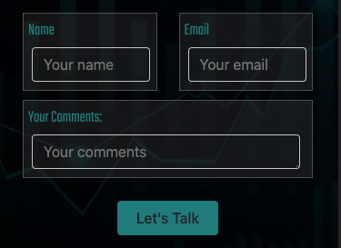

    - The USER can contact the developer using the form provided on the contact page.

 
Back to README - [Back](README.md)
 
 
 
 
  
 
## 5. Bugs
---
 
- Detailed below are errors found and actions taken to resolve them.

- Fixed: by naming them nav and nav-mob respectively.
 
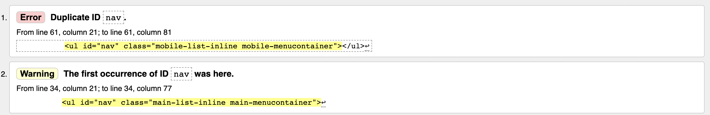
 
- Fixed: Correctly enclosed a tag and remove stray div tag.
 
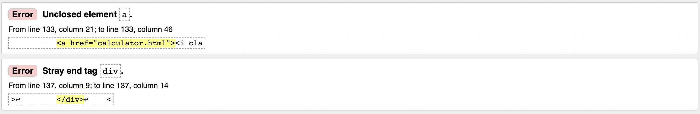

- Fixed: Removed stray ul tag.
 
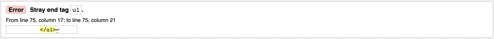

- Fixed: Added full file path for images so they display when site deployed.
 
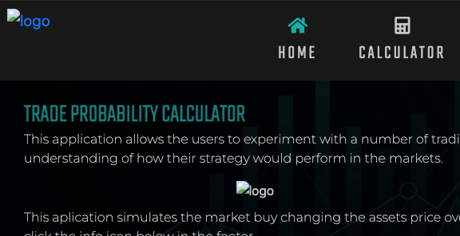

- Fixed: Found and replaced misspelt element id.
 
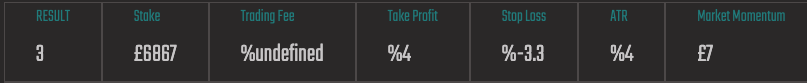

- Fixed: Added function to stop users being able to click 'Calculate Trade' until all fields have been entered.
- Fixed: Early on sideways scroll issue

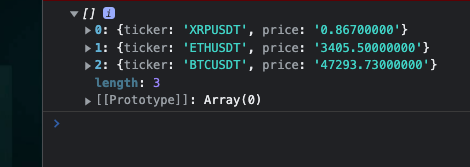
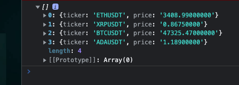
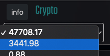

- Fixed: wrote new script to replace API websocket feed that was causing the menu to be clitchy and sometimes not load all 4 options and often difficult to click on as it flickerd when hoverd over.
The colesole.log screen shots show how it wouldn't allways get all 4 prices

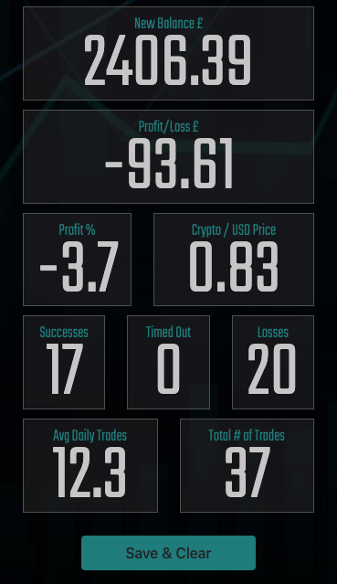
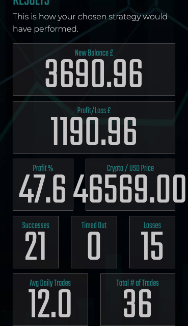
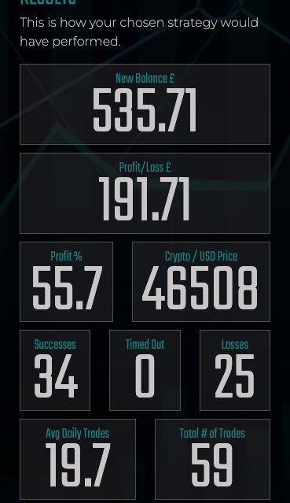

- Fixed: added an if statement to remove decimal points from any price greater than 100 so that the price would display inside the box as seen above.

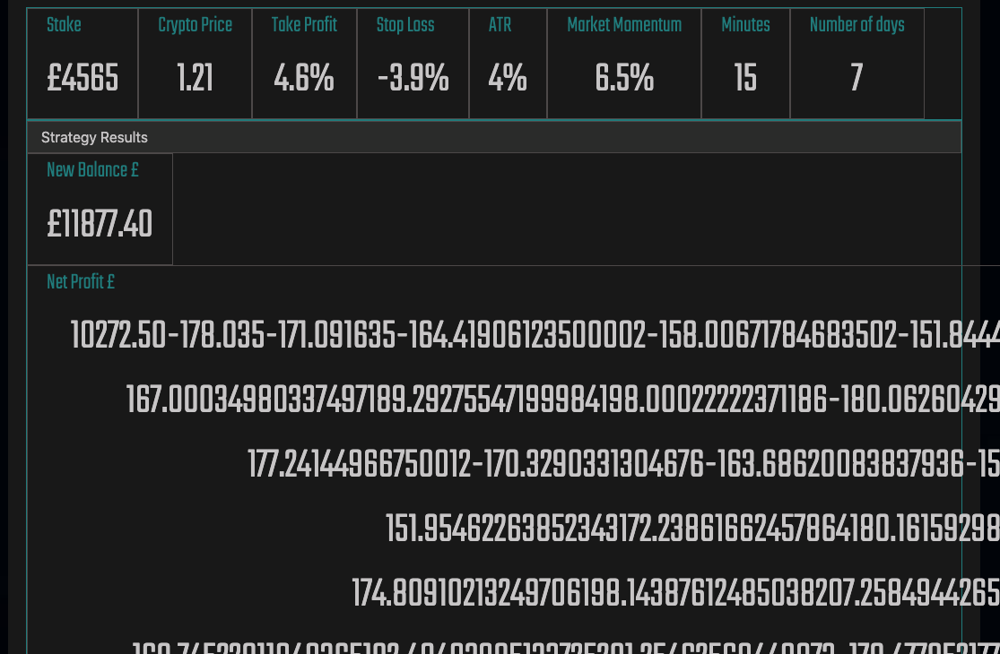
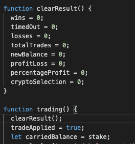

- Fixed: Added the clearResult function to ensure each saved entry would not add on to previous trade calculations

[Go back to README.md file](README.md).
 
